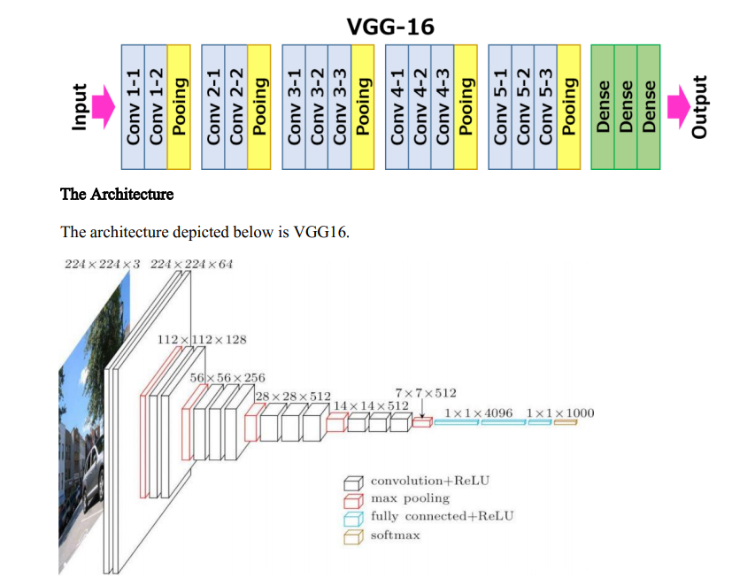
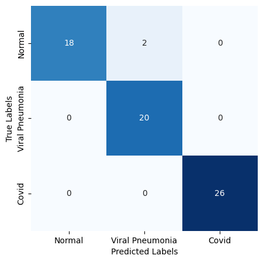

# Multiclass image classification (X-ray)

## 1. Overview
This repositiory presents a very simple example of multiclass image classification.  
The problem objective was to learn to distinguish 3 classes related to lung state based on X-ray images.  The classes present in the dataset are: COVID-19, Viral Pneumonia, Normal.  
For this problem the Vgg16 pre-trained model was used, achieving promising results.
The dataset can be downloaded from [Kaggle](https://www.kaggle.com/datasets/pranavraikokte/covid19-image-dataset)

  

## 2. Model used

The used consists of VGG-16 pre-trained model with an addition of layers. The architecture overview is presented below: 

  

  

## 3. Training
The training/ validation loss is presented below:

  

The training/ validation accuracy is presented below:

  

## 4. Results
Because the task is a classification task, accuracy is not the best metric for the task. 
To analyze the performance of the model the confusion matrix is plotted. Based on the obtained results it is noted that only 2 instances were missclassified.

  

The missclassified images are displayed below: 

  

## 5. Possible improvements
To further improve the results a few additions can be made:
- Data augmentation such as scalling, rotation and more (*the code snippet is added to the notebook*)
- Optimizing F1 score instead of accuracy (*the code snippet is added to the notebook*)

